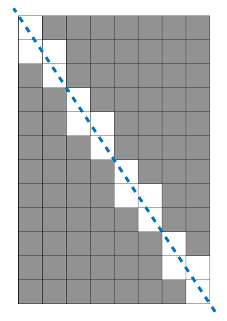

### 오늘의 문제
[프로그래머스 멀쩡한 사각형](https://programmers.co.kr/learn/courses/30/lessons/62048#qna)    

문제 간략 설명 : 12 by 8 배열의 사각형에서 대각선의 불능을 제외 후 개수를 세어 반환하는 문제


### 풀이 방법

<!-- {"width":379} -->

문제의 답을 직관적으로 알 수 있다. 가로 2씩 세로 3씩 증가하고, 3 by 2의 도형 안에서 불능 도형의 개수를 찾고, 이 패턴이 몇 번 반복되는지 알아내면 된다 !    

8 → 2, 12 → 3 니까 4 ! → 4번 패턴이 반복되는 건 두 수 사이의 최대공약수를 찾아주면 된다.  

3 by 2 은 6개 중 4개가 불능, 12 by 8 은 96개 중 16개가 불능이다.   

주어진 가로와 세로에 최대공약수를 나누어주고 -1을 한다. 그러고 반복되는 패턴이 4번 (12와 8의 최대공약수)이니 이만큼 곱해준다! ...최대공약수 함수는 구글링해서 주웠다. ㅎㅎ 근데 math 모듈에 있더라고? 암튼         

```
((w / gcd(w, h) + h / gcd(w, h)) - 1 ) * gcd(w, h)
```

그러고 전체 도형에서 불능 도형의 개수를 빼주면 끝~


### 사담

 개인적으로 직관적인 문제는 무식하게 풀 수 있다고 생각하기에... 빈 종이에 손으로 쓰면서 문제를 풀었다.  

대각선이 지나갈 때의 불능 도형의 개수가 제일 머리 아팠다... 뭐랄까 애기 때 수학 공부를 잘했으면 금방 풀었을텐데 하는 생각이 들 정도로 간단해보이는데 잘 모르겠고... 이게 맞는데 왜 그런지는 모르겠는 그런 너낌    

직관적인 문제 → 무식하게 풀기 가 아니라 그냥 무식한 나도 풀 수 있다는 걸 알게됐다...🥲