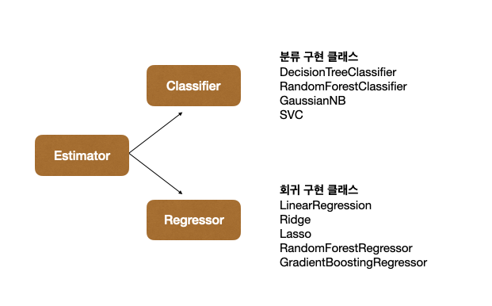

# Machine Learning Starts with scikit-learn

### Split Train-Test set
```
from sklearn.model_selection import train_test_split
train_test_split(data, label, test_size = 0.2, random_state = 11)
```
- test_size : 학습데이터와 테스트 데이터를 파라미터 입력 값의 비율로 분할한다.
- random_state = random seed

### Accuracy Score
```
from sklearn.tree import DecisionTreeClassifier
dt_clf = DecisionTreeClassifier(random_state = 11)
dt_clf.fit(X_train, y_train)
pred = dt_clf.predict(X_test)

from sklearn.metrics import accuracy_score
print('{:0.4f}').format(accuracy_score(y_test, pred)))
```

- `fit()` :  학습용 피처 데이터 속성과 결정값 데이터 셋을 입력해 호출 -> 학습 수행
- `predict()` : 테스트 데이터 셋에 대한 예측값 반환
- `accuracy_score()` : 파라미터 1. 실제 라벨 데이터 셋, 2. 예측 라벨 데이터 셋


## Framework based on scikit-learn
**Estimator** : Classifier(분류) + Regressor(회귀)
	- 지도학습의 모든 알고리즘을 구현한 클래스를 통칭함
- Estimator가 인자가 되는 경우: `cross_val_score()`와 같은 evaluation 함수나 `GridSearchCV` 와 같은 하이퍼 파라미터 튜닝을 지원할 때, Estimator의 `fit()`과 `predict()`를 호출해서 평가를 하거나하이퍼 파라미터 튜닝을 수행
