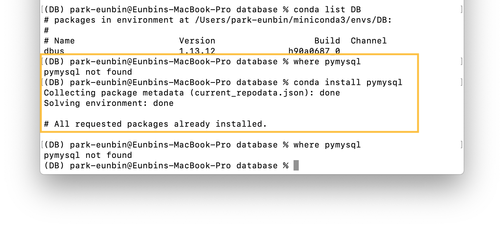
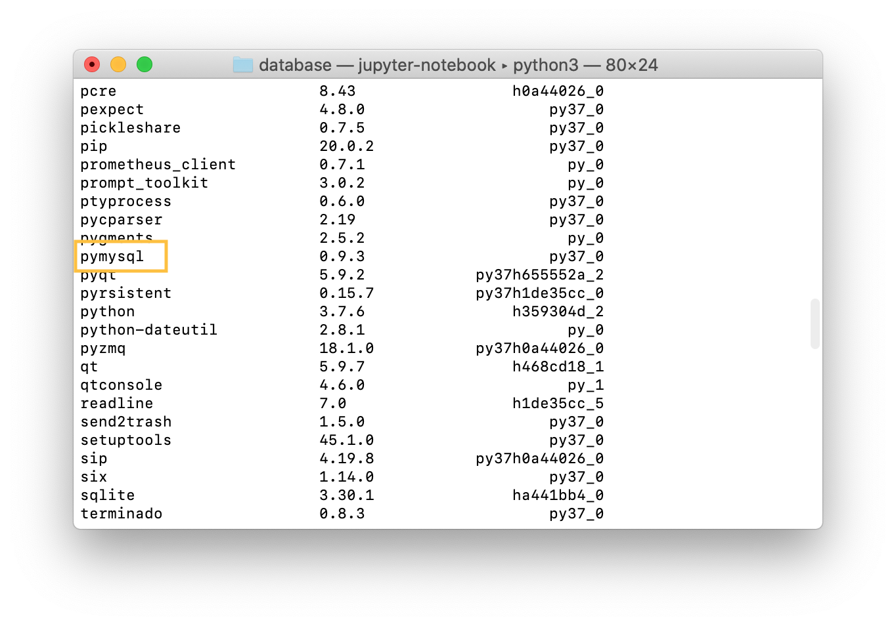

### 오류

기실 멀쩡히 돌아가는 화면 보다 오류를 더 많이 본다! 하하

---







`where pymysql` 을 하면 찾을 수 없다고 하면서... 설치하려니까 `already install` 를 보여줬다. 설치되어있는 패키지도 확인 했는데... 분명히 있는데... 

1. 재부팅
2. 설치 확인
3. 삭제 후 재설치

모두 했는데 안 된다는 건... 역시 내 문제라는 이야기다.


### 해결

전제조건부터 잘못 되었다. 터미널에서 가상환경을 열고 ! 주피터를 켜면 ! 그게 가상환경과 주피터의 만남...✨이라는 조건을 넣고 들어가서 뭐든 안 됐던 거다. 

 


1. 

```
$ python -m ipykernel install --user --name=envs'_name
```

2. 

```
python -m ipykernel install --user
```


터미널 창에서 입력해준 후에... 주피터에서 새로 파일을 만들면! 짜잔

1번 방법으로 하면 이렇게 나온다!


<br>

##### 첫 번째 해결책 커널 지우는 법

```
jupyter kernelspec uninstall Kernel_name
```

